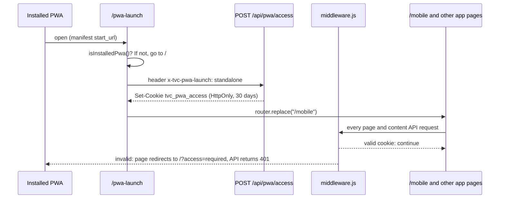

# TheValueChain

An installable, mobile-first Progressive Web App for [TheValueChain](https://thevaluechainng.com): energy news, PDF e-copy editions, YouTube videos and a live stream, in one app shell.

Built with the Next.js App Router. The public site is a single landing page that explains how to install the app. Everything else is only reachable from the installed app.

## Contents

- [Stack](#stack)
- [Getting started](#getting-started)
- [Environment variables](#environment-variables)
- [Scripts](#scripts)
- [Project map](#project-map)
- [How the app works](#how-the-app-works)
- [Pages](#pages)
- [API routes](#api-routes)
- [Components](#components)
- [Library helpers](#library-helpers)
- [Service worker and offline behaviour](#service-worker-and-offline-behaviour)
- [Configuration files](#configuration-files)
- [CI and automation](#ci-and-automation)
- [Known gaps](#known-gaps)

## Stack

| Area | Choice |
|---|---|
| Framework | Next.js 15 (App Router), React 19 |
| Language | JavaScript, with two TypeScript files (`app/actions.ts`, `app/api/pwa/revalidate/route.ts`) |
| Styling | Tailwind CSS 4 through `@tailwindcss/postcss`, Poppins from `next/font` |
| PDF | `react-pdf` 9 with a PDF.js 4.8.69 worker served from `public/` |
| Video | YouTube embeds, `hls.js` for the live stream |
| Carousel | `swiper` |
| Feeds | `xml2js` (YouTube RSS), `he` (HTML entity decoding) |
| PWA | Hand-written service worker (`public/sw.js`) and `public/manifest.json` |

## Getting started

Requires Node 22 (the version CI uses) and npm.

```bash
npm install
cp .env.example .env.local   # then fill in the values
npm run dev
```

Open <http://localhost:3000>. You will see the landing page.

### Seeing the app pages locally

`/mobile`, `/news`, `/ecopy`, `/video` and `/stream` redirect to `/?access=required` unless the browser holds a signed access cookie. There are two ways to get one in development:

1. Install the PWA from the landing page and launch it. This is the real flow.
2. Ask the access endpoint for a cookie directly from the browser console on `localhost:3000`:

   ```js
   await fetch("/api/pwa/access", {
     method: "POST",
     headers: { "x-tvc-pwa-launch": "standalone" },
   });
   ```

   Then visit `/mobile`. Outside production a built-in development secret signs the cookie, so no extra setup is needed.

## Environment variables

| Variable | Used by | Purpose |
|---|---|---|
| `WORDPRESS_API_URL` | `app/api/news/route.js` | URL of the news feed. Must return a JSON array of posts. A single post is fetched from `<url>/<id>`. |
| `ECOPY_API_URL` | `app/api/ecopy/route.js` | URL returning a JSON array of PDF editions, each with `title`, `date` and `url`. |
| `STREAM_URL` | `app/api/stream/route.js` | Live stream URL. `.m3u8` URLs are played as HLS. |
| `CHANNEL_ID` | `app/api/youtube/route.js` | YouTube channel ID for the video feed. |
| `PWA_ACCESS_SECRET` | `lib/pwaAccess.js` | Signs the access cookie. **Required in production.** |
| `REVALIDATION_SECRET` | `app/api/pwa/revalidate/route.ts`, `app/actions.ts` | Guards the cache revalidation endpoint. |
| `APP_ACCESS_SECRET` | `lib/pwaAccess.js` | Optional. Second choice for the cookie signing secret. |
| `NEXT_PUBLIC_HOST` | `app/actions.ts` | Optional. Base URL used when calling the revalidation endpoint. Defaults to `http://localhost:3000`. |

The cookie signing secret is resolved in this order: `PWA_ACCESS_SECRET`, `APP_ACCESS_SECRET`, `REVALIDATION_SECRET`. If none is set in production, `/api/pwa/access` returns 503 and installed users get stuck on the launch screen with "App access is not configured on this deployment."

The news pages expect each post to have `id`, `title`, `excerpt`, `content`, `date`, `image` and `categories` (an array of names), plus optional `sticky` and `featured_media`.

## Scripts

| Command | What it does |
|---|---|
| `npm run dev` | Start the development server. |
| `npm run build` | Production build. |
| `npm start` | Serve the production build. |
| `npm run lint` | Run `next lint` (ESLint with `next/core-web-vitals`). |
| `npm run clean` | Delete `.next`, `node_modules` and `.cache`. |
| `npm run analyze` | Does not work at present. See [Known gaps](#known-gaps). |

There is no test suite.

## Project map

```text
app/
  layout.js               Root layout: font, metadata, service worker registration
  globals.css             Tailwind import, theme variables, animations, scroll helpers
  page.js                 Public landing and install page (/)
  pwa-launch/page.js      Start URL of the installed app; obtains the access cookie
  mobile/page.js          App home: featured carousel, categories, latest news
  news/page.js            Full news list with search and category filter
  news/[id]/page.js       Single article
  ecopy/page.js           PDF edition library
  ecopy/[id]/page.js      PDF reader
  video/page.js           YouTube videos
  stream/page.js          Live stream player
  offline/page.js         Offline fallback page
  actions.ts              revalidatePWA() helper (not called anywhere yet)
  api/
    news/route.js         News feed and single article
    ecopy/route.js        PDF edition list
    pdf/route.js          PDF proxy
    youtube/route.js      YouTube channel feed
    stream/route.js       Live stream URL
    pwa/access/route.js   Issues the signed access cookie
    pwa/revalidate/route.ts  Secret-guarded cache revalidation

components/               Shared client components (nav, prompts, splash, search)
lib/                      PDF worker setup, access token signing, PWA detection
middleware.js             Access gate for app pages and content APIs
public/                   Service worker, manifest, PDF.js workers, images
.github/                  CI workflows and Dependabot config
```

Root config: `next.config.js`, `eslint.config.mjs`, `tsconfig.json`, `jsconfig.json`, `postcss.config.mjs`, `.lighthouserc.js`.

`docs/` and `workflows/` are git-ignored and exist only on the machines that created them.

## How the app works

### Two audiences, one deployment

- **Browser visitors** see only `/`, the landing page, which sells the app and walks them through installing it.
- **Installed-app users** start at `/pwa-launch`, receive an access cookie, and land on `/mobile`. From there the bottom navigation reaches e-copy, videos and the live stream.

### The access gate



1. `public/manifest.json` sets `start_url` to `/pwa-launch`.
2. `app/pwa-launch/page.js` checks the display mode with `isInstalledPwa()`. A normal browser tab is sent back to `/`.
3. It POSTs to `/api/pwa/access` with the header `x-tvc-pwa-launch: standalone`.
4. The endpoint checks that the request is same-origin and that the header holds an allowed value (`standalone` or `install-accepted`), then sets the `tvc_pwa_access` cookie. The cookie is HttpOnly, `SameSite=Lax`, `Secure` in production, and lasts 30 days.
5. The token is `v1.<issuedAt>.<signature>`, where the signature is an HMAC SHA-256 of `v1.<issuedAt>`.
6. `middleware.js` verifies the cookie on every request to a protected page or content API. Failed checks clear the cookie, then redirect pages to `/?access=required` and answer API calls with 401.

Three other places request the same cookie:

- `components/mobileRed.js`, when an installed app opens `/` (for example through a manifest shortcut whose cookie has expired).
- `components/OpenAppBtn.jsx`, the "Open App" button on the landing page.
- `components/prompt.js`, straight after the user accepts the install prompt.

**This is a soft gate, not authentication.** The server cannot prove a request came from an installed app. Anyone who sends the right header from the same origin gets a cookie. It keeps casual browser visitors and crawlers out of the app pages; it does not make the content private.

### Data flow

Every app page is a client component. Each one fetches from this app's own API routes after mount, and shows a skeleton, an error state with a retry button, or the content.

```text
page (client)  ->  /api/* route (server)  ->  upstream source
/mobile, /news     /api/news                  WORDPRESS_API_URL
/news/[id]         /api/news?id=              WORDPRESS_API_URL/<id>
/ecopy             /api/ecopy                 ECOPY_API_URL
/ecopy/[id]        /api/pdf?url=              thevaluechainng.com PDF
/video             /api/youtube               YouTube RSS feed
/stream            /api/stream                STREAM_URL (played in the browser)
```

The API routes keep upstream URLs and the channel ID on the server and reshape the responses for the pages.

## Pages

### `/` — `app/page.js`

Server component. Renders the hero, three "install reasons", three feature cards, a three-step install guide and the footer. It mounts three client components: `MobileRedirect` (sends installed users to `/mobile`), `OpenAppButton` (visible only when running installed) and `InstallPrompt` (bottom sheet).

### `/pwa-launch` — `app/pwa-launch/page.js`

The app's start URL. Requests the access cookie and replaces the route with `/mobile`. On failure it retries every 2.5 seconds, up to three attempts, unless the failure is permanent (`Unauthorized`, or the secret is not configured). Shows a spinner while working and a short message when it gives up.

### `/mobile` — `app/mobile/page.js`

App home. Fetches `/api/news` and renders:

- a splash screen, once per session (`SplashScreen`);
- a top bar with the logo and a search button that opens `SearchOverlay`;
- a Swiper carousel of featured stories, autoplaying every 4.2 seconds;
- category chips;
- up to ten stories filtered by category and search text, with a "View all" link to `/news`.

### `/news` — `app/news/page.js`

The full list. Has an inline search box, up to eight category chips built from the loaded posts, a large "lead story" card for the first result and compact cards for the rest. The share button calls the Web Share API when the browser has one.

### `/news/[id]` — `app/news/[id]/page.js`

Fetches `/api/news?id=<id>`. The article body is converted to plain paragraphs: HTML entities are decoded, block-level closing tags become paragraph breaks, and all remaining tags are stripped. No upstream HTML is rendered, so formatting, links and inline images in the body are lost. Any failure shows an "Article not found" screen with Retry and a link back to the list.

### `/ecopy` — `app/ecopy/page.js`

Fetches `/api/ecopy` and shows the editions in a grid, six per page, with a search box that filters by title and date. Each card links to `/ecopy/<id>?url=<pdf url>&title=<title>`. The PDF location travels in the query string.

### `/ecopy/[id]` — `app/ecopy/[id]/page.js`

The reader. Takes `url` and `title` from the query string and loads the PDF through `/api/pdf?url=...`. Renders one page at a time, sized to the container (capped at 820px) with a `ResizeObserver`. Navigate with Prev and Next, or swipe more than 50px. The top bar has a download link to the proxied file.

### `/video` — `app/video/page.js`

Fetches `/api/youtube` and renders up to six sandboxed YouTube iframes per page with Previous and Next controls.

### `/stream` — `app/stream/page.js`

Fetches the stream URL from `/api/stream`. For `.m3u8` URLs it uses native HLS where the browser supports it (Safari) and otherwise loads `hls.js` on demand. Any other URL is set directly as the video source. The `hls.js` instance is destroyed on unmount.

### `/offline` — `app/offline/page.js`

The page the service worker serves when a navigation fails. Refreshes automatically 800ms after the browser reports it is back online, and has a manual "Try again" button that reports "Still offline" when there is no connection.

## API routes

| Route | Runtime | Gated | Behaviour |
|---|---|---|---|
| `GET /api/news` | Node | Yes | Fetches the whole feed, sorts newest first, and returns `newsFeed` (first 10), `trendingNews` (up to 5 posts that are sticky or have featured media, falling back to the first 5), `categories` and `lastUpdated`. |
| `GET /api/news?id=` | Node | Yes | Tries `<WORDPRESS_API_URL>/<id>` first, then falls back to finding the post in the full feed. Returns 404 if neither has it. |
| `GET /api/ecopy` | Edge | Yes | Keeps entries whose title matches "value chain", whose date starts with the current or previous year, and that have a `url`. Sorted newest first. Returns `count`, `pdfs`, `builtAt`. |
| `GET /api/pdf?url=` | Node | Yes | Streams a PDF from upstream. Only `https://thevaluechainng.com` and `https://www.thevaluechainng.com` are allowed; anything else gets 403. |
| `GET /api/youtube` | Node | Yes | Parses the channel's RSS feed and returns up to 10 `items` with `id`, `title`, `description`, `thumbnailUrl`, `published`, `link`. |
| `GET /api/stream` | Node | Yes | Returns `{ url }` with `Cache-Control: no-store`, or 503 when unset. |
| `POST /api/pwa/access` | Node | No | Issues the access cookie. Also answers `OPTIONS` for CORS preflight. |
| `POST /api/pwa/revalidate` | Node | No | Body: `{ secret, urls?, tags? }`. Compares `secret` to `REVALIDATION_SECRET` in constant time, then calls `revalidateTag` and `revalidatePath` for each entry. |

Caching: the news and YouTube upstream fetches revalidate every 24 hours, and the e-copy fetch every 7 days under the tag `ecopy-pdfs`. Successful news, e-copy, YouTube and PDF responses are sent with `Cache-Control: public, max-age=86400`.

To refresh the e-copy list on demand:

```bash
curl -X POST https://<host>/api/pwa/revalidate \
  -H "Content-Type: application/json" \
  -d '{"secret":"<REVALIDATION_SECRET>","tags":["ecopy-pdfs"]}'
```

## Components

| File | Role |
|---|---|
| `nav.js` | Fixed bottom navigation: Home (`/mobile`), Ecopy, TV (`/video`), Live (`/stream`). Highlights the active section. |
| `navButtons.js` | Top bar row with a back button, optional title and optional share button. Used by the news pages. |
| `searchOverlay.js` | Modal search bar on `/mobile`. Locks page scroll and closes on Escape or backdrop click. |
| `splash.js` | Logo splash shown once per session in the installed app, tracked in `sessionStorage`. |
| `prompt.js` | Install bottom sheet. Captures `beforeinstallprompt` on Chromium browsers; on iOS it shows "Add to Home Screen" instructions. Dismissal is remembered for 7 days in the `pwa-install-dismissed` cookie. |
| `OpenAppBtn.jsx` | "Open App" button, rendered only when running installed. |
| `mobileRed.js` | On `/`, requests the access cookie and moves installed users to `/mobile`. |
| `swRegister.js` | Registers `/sw.js` and shows a "New version available" pill with an Update button. |
| `appReady.js` | Context that flips to `true` after hydration. Wraps the app in the root layout; `useAppReady()` has no callers. |
| `CurrentYear.js` | Renders the current year in the footer. |
| `protectedRoutes.js` | Pass-through wrapper that renders its children. Kept so pages did not need editing when the gate moved into `middleware.js`. |
| `PdfViewerComponent.js` | First-page PDF preview. Not imported anywhere. |

## Library helpers

- `lib/pwaAccess.js` — cookie name and lifetime, plus `createAccessToken()` and `verifyAccessToken()`. Uses Web Crypto so it runs in middleware. Rejects tokens that are malformed, the wrong version, older than 30 days, or dated more than 5 minutes in the future.
- `lib/pwaDisplayMode.js` — `isInstalledPwa()`: true for `standalone`, `minimal-ui` or `fullscreen` display modes, or iOS `navigator.standalone`.
- `lib/pdfConfig.js` — `configurePdfWorker()`: points PDF.js at `/pdf.worker.js`, once.

## Service worker and offline behaviour

`public/sw.js` is written by hand; there is no build step for it.

- **Install:** precaches `/offline`. It does not call `skipWaiting()`, so a new version waits until the user taps Update in the `swRegister.js` prompt.
- **Activate:** claims open clients and deletes caches whose names are not in the current list. Bump the `-v2` suffixes to invalidate old caches.
- **Fetch (GET only):**

| Request | Strategy |
|---|---|
| Navigation to a protected page | Network only, falling back to `/offline` |
| Any other navigation | Network first with a 5 second timeout, then cache, then `/offline` |
| Protected content API (`/api/news`, `/api/ecopy`, `/api/pdf`, `/api/stream`, `/api/youtube`) | Network only, never cached |
| Images, including YouTube thumbnails | Cache first |
| `thevaluechainng.com/wp-json/*` | Network first with an 8 second timeout |

Protected pages and APIs deliberately bypass the cache so the middleware decision is always fresh. The consequence is that **app content is not available offline**: with no connection, the user gets the offline page. Only the landing page, the offline page and images are served from cache.

The protected route lists appear in both `middleware.js` and `public/sw.js`. Change them together.

`public/manifest.json` declares the app name, `start_url: /pwa-launch`, standalone display, portrait orientation, icons, two screenshots, and shortcuts to `/news` and `/stream`.

## Configuration files

- **`next.config.js`** — React strict mode; remote images allowed from the two `thevaluechainng.com` hosts; webpack rule to emit PDF worker files as assets. Sets security headers on every route: `X-Content-Type-Options`, `X-Frame-Options: DENY`, `Referrer-Policy`, `Permissions-Policy`, HSTS, and a Content Security Policy. `/sw.js` gets `no-cache` and its own stricter CSP.
- **`middleware.js`** — the access gate described above. Also redirects user agents matching `bot|crawler|spider|crawling` away from `/mobile`.
- **`eslint.config.mjs`** — flat config extending `next/core-web-vitals`.
- **`tsconfig.json` / `jsconfig.json`** — `@/*` path alias to the repo root. `allowJs` is on and `checkJs` is off, so JavaScript files are not type-checked.
- **`postcss.config.mjs`** — Tailwind's PostCSS plugin.
- **`.lighthouserc.js`** — Lighthouse CI: three runs each of `/`, `/news` and `/ecopy` with the desktop preset. Accessibility below 0.85 fails; performance (0.7), best practices (0.8) and SEO (0.8) warn.
- **`package.json` `overrides`** — pins `postcss` to `8.5.28` to clear an audit advisory in Next's nested copy.

When adding a new third-party origin (an image host, an API, an embed), update the CSP in `next.config.js` or the browser will block it.

## CI and automation

| Workflow | Triggers | What it does |
|---|---|---|
| `lighthouse.yml` | Push and PR to `main`, Wednesdays 06:00 UTC, manual | Builds, starts the production server, runs `lhci autorun`, uploads results, and posts or updates a score table on the PR. |
| `security.yml` | Push and PR to `main`, Wednesdays 06:00 UTC, manual | `npm audit` (fails on critical), TruffleHog verified-secret scan. CodeQL and Dependency Review run only when the repository variable `ENABLE_GHAS` is `true`. |
| `dependency-audit.yml` | Changes to `package.json` or the lockfile, Mondays 07:00 UTC, manual | `npm audit` (fails on high or critical, comments on PRs with moderate or worse). The scheduled run also opens or updates an "Outdated dependencies" issue. |

`dependabot.yml` opens weekly grouped PRs (Mondays 06:00 Africa/Lagos) for npm packages and GitHub Actions.

Lighthouse CI can use an optional `LHCI_GITHUB_APP_TOKEN` secret for status checks.